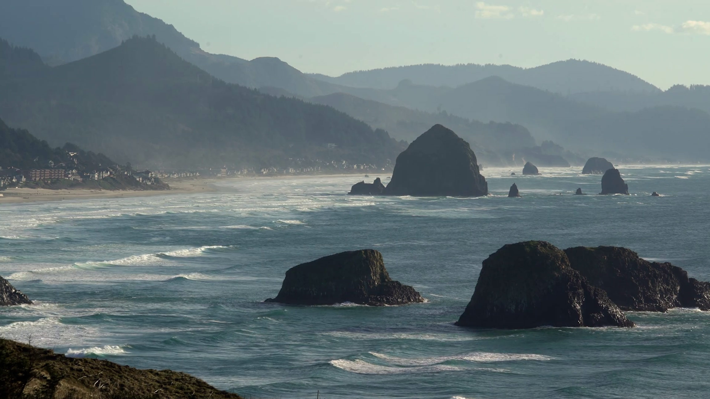

# The Story of The Goonies — Interactive Parallax Experience

An award-winning, 1-to-1 cinematic parallax recreation of the legendary Awwwards Site of the Day experience for **The Goonies**. Features an organic foreground parting-curtain hero animation, camera push-in over Cannon Beach & Haystack Rock, typography in authentic `Abuget` script & `SharpGroteskBook25`, animated vertical plot guide, full Cast Dossier section, and the permanent **"Books of Her Choice"** digital bookshelf.



## 🌟 Interactive Flow & Keyframes

1. **Initial State (`0% Scroll`)**:
   - Foreground silhouette foliage frames the left and right borders (`bg-scroll`).
   - Center aperture showcases the Pacific Ocean waves and the monoliths of Cannon Beach (`bg-main`).
   - Overlaid script subtitle: `"The story of"` (`Abuget.ttf`).
   - Cutout title logo: `"THE GOONIES"` (`assets/goonies_logo.png`).
   - Top navigation bar: `Plot` (with active illuminated dot), `Goonies`, `Credits`, and `Books of Her Choice`.
   - Floating Awwwards `"Site of the Day"` vertical badge on the right edge.
   - Mouse scroll indicator gif at bottom center.

2. **Parting Curtain Phase (`20% - 65% Scroll`)**:
   - As the user scrolls, `bg-scroll` scales up from `1.0` to `1.80`.
   - Because tree trunks are anchored to the left and right edges, the scale zooms the trees outward to the sides, parting like theatrical curtains.
   - The central ocean scene pushes forward (`scale: 1.0 -> 1.25`).
   - The Goonies logo gently zooms and fades to `0` opacity.

3. **Plot Synopsis Presentation (`45% - 72% Scroll`)**:
   - The trees have parted out of frame.
   - The headline `Plot` in `SharpGroteskBook25` and the exact synopsis text glide up into the center with pristine typography.

4. **Darkening Overlay & Descending Line (`60% - 85% Scroll`)**:
   - A smooth dark overlay gently darkens the ocean into rich charcoal.
   - A 1px crisp vertical line draws downwards from beneath the Plot text, guiding the viewer's eye into the next section.

5. **The Goon Docks Crew (Cast Section)**:
   - Full dossiers for Mikey, Chunk, Sloth, Mouth, and Data with high-res character portraits.
   - Interactive pop-up modals containing full quotes and movie lore.

6. **Books of Her Choice (Permanent Bookshelf)**:
   - Curated archive pre-loaded with timeless stories (*The Neverending Story*, *Treasure Island*, *The Goonies: The Novel*).
   - Glassmorphic modal to add custom books with Title, Author, Year, Genre, Spine Color, 1–5 Star ratings, and personal reflections.
   - **100% Persistent (`localStorage`)**: Any book added by her is permanently preserved across reloads and browser sessions.
   - Live search filter and genre filter pills (*All, Adventure, Philosophy, Fantasy, Classic, Lore*).

7. **Atmospheric Procedural Web Audio Engine**:
   - Ambient analog synthesizer pad and sea-breeze noise generator inspired by Dave Grusin's score.
   - Toggled via the minimalist speaker button in the bottom right corner.

## 🚀 Running Locally

```bash
# Python
python -m http.server 8080

# Or Node / npx
npx serve .
```

Open [http://localhost:8080](http://localhost:8080) in your browser.

## 📁 Repository Structure

```
├── index.html                  # Semantic HTML5 markup
├── styles.css                  # Typography, exact layout, responsive styling
├── script.js                   # 60FPS lerp parallax, Bookshelf & Web Audio
├── assets/                     # High-res assets, fonts, icons
│   ├── pillar_left.png         # Left carved stone pillar & ornate corbel
│   ├── pillar_right.png        # Right carved stone pillar & ornate corbel
│   ├── pillars_foreground.png  # High-res composite pillars foreground
│   ├── Abuget.ttf              # Official script font
│   ├── SharpGroteskBook25.ttf  # Official headline font
│   ├── alphakore_hero_v2.jpg   # Background hero scene
│   ├── goonies_hero.jpg        # Alternate Goonies background
│   ├── goonies_logo.png        # Official Goonies logo
│   ├── goonies_scroll.gif      # Animated scroll indicator
│   ├── goonies_speaker.png     # Audio speaker icon
│   ├── goonies_sloth.png       # Sloth character cutout
│   ├── cast_chunk.jpg          # Chunk Cohen portrait
│   ├── cast_data.jpg           # Data Wang portrait
│   ├── cast_mouth.jpg          # Mouth Devereaux portrait
│   └── hero_char_raw.jpg       # Mikey Walsh portrait
└── README.md
```

## 📜 Authorship

Crafted for **Neverfinished005** (`vablerudra007@gmail.com`).
All rights reserved for creative showcase.
