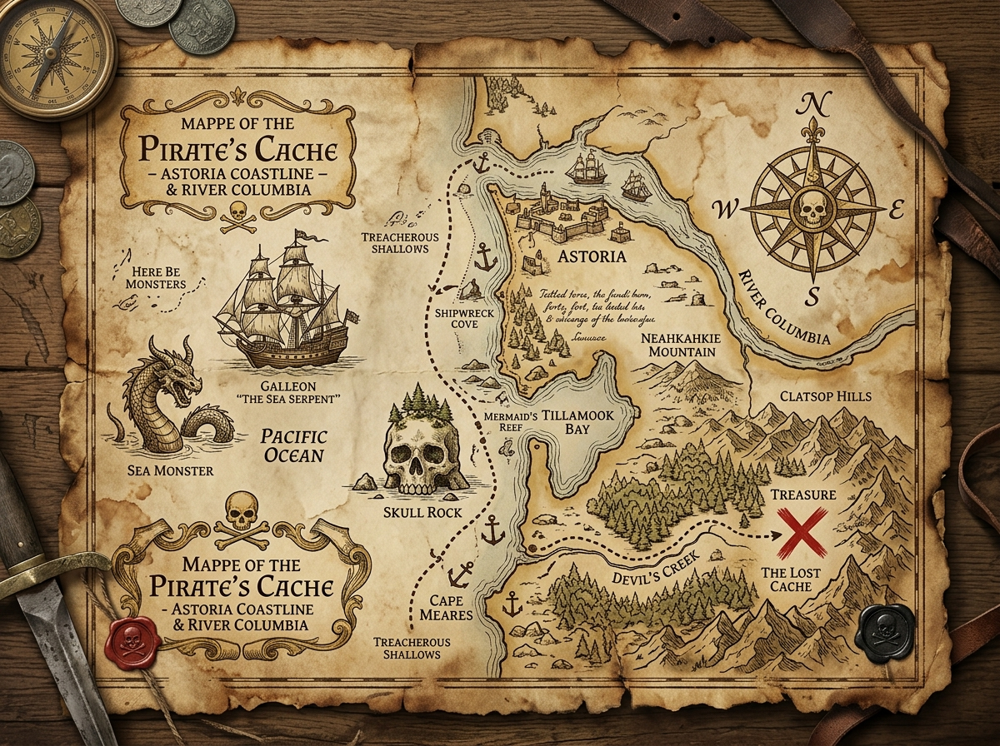

# The Goonies — Cinematic 3D Parallax Experience

A state-of-the-art interactive web experience cloning and elevating the iconic style of **[the-goonies.webflow.io](https://the-goonies.webflow.io/)**. Built with vanilla HTML5, CSS3, and JavaScript featuring 60FPS multi-layer depth, camera fly-through zoom, procedural Web Audio synthesizer, and an interactive Adventure Bookshelf.



## ✨ Features

- **Cinematic 3D Mouse Parallax Engine**:
  - Continuous 60FPS linear interpolation (`lerp`) with fluid mouse tracking and mobile gyroscope tilt.
  - Multi-plane 3D perspective layers (background sea stacks, volumetric mist, giant typography, cutout character, and floating pirate props).

- **Guaranteed Viewport-Pinned Deep Zoom Fly-Through**:
  - As you scroll down, the viewport remains 100% pinned without any sliding or black gaps.
  - The camera pushes forward into the Oregon coastal sea stacks, scaling the giant logo (`THE GOONIES`) up to 5.2x and flying past the camera edges.
  - Floating 3D props (One-Eyed Willy's key, skull talisman, Spanish doubloons, compass) scatter outwards.
  - In-scene **Plot** title, story synopsis, and golden vertical accent line draw down right in the center of the deep zoomed mist.
  - Seamless handoff to Section 2 (**The 4-Column Cast Showcase** for Mikey, Chunk, Data, and Mouth).

- **Interactive Bookshelf (Books of Her Choice)**:
  - Dedicated **Books** tab in navigation.
  - Curated library of adventure books preserved in `localStorage`.
  - Glassmorphic modal to add custom books with Title, Author, Genre, Publication Year, 1-5 Star rating, spine palette themes (Leather Gold, Ocean Blue, Crimson Velvet, Emerald Pine, Obsidian Black), and personal notes.
  - Real-time search filter and genre filter pills.

- **Atmospheric Web Audio Engine**:
  - Procedural sound synthesizer generating an authentic 80s analog ambient drone.
  - Dynamic metallic coin clinks and chime chords on hover and click interactions.

- **Interactive Secret Pirate Map Modal**:
  - Burnt-edge parchment map with pulsing radar hotspots for Shipwreck Cove, Skull Rock, and The Inferno's Cache.

## 🚀 Running Locally

You can run this project locally with any static web server:

```bash
# Using Python
python -m http.server 8080

# Using Node / npx
npx serve .
```

Open [http://localhost:8080](http://localhost:8080) in your browser.

## 📁 Project Structure

```
├── index.html          # Main HTML structure with semantic sections & modal drawers
├── styles.css          # Cinematic design system, 3D perspective, responsive layout
├── script.js           # 60FPS parallax render loop, scroll scrubber, Web Audio & Bookshelf engine
├── assets/             # High-resolution cutouts, textures, and cast photography
│   ├── hero_bg.jpg
│   ├── hero_char.png
│   ├── pirate_key.png
│   ├── gold_doubloon.png
│   ├── skull_talisman.png
│   ├── compass.png
│   ├── treasure_map.jpg
│   └── ...
└── README.md
```

## 📜 License

Inspired by the 1985 classic film *The Goonies* (Amblin Entertainment / Warner Bros. Pictures). Educational and creative portfolio demo.
